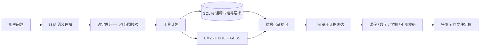

<div align="center">

# 🎓 SWUFE 教务智能问答

**可验证的 SQL + RAG 教务知识系统**

让课程、学分与制度问答回到原文件、原页码和可复核证据。

[](https://www.python.org/)
[](https://fastapi.tiangolo.com/)
[](https://www.sqlite.org/)
[](https://github.com/facebookresearch/faiss)
[](https://github.com/ZorIgn/swufe-rag/actions/workflows/tests.yml)

[核心能力](#-核心能力) · [查询架构](#️-查询架构) · [快速开始](#-快速开始) · [HTTP API](#-http-api) · [数据更新](#-数据更新)

</div>

---

## 📖 项目简介

**SWUFE 教务智能问答**面向西南财经大学学生，将培养方案课程表、毕业学分要求与校级教务制度统一到一条可验证的查询链路中。

项目不要求大语言模型“记住”学校事实，而是按信息类型选择可靠工具：

| 信息类型 | 处理方式 | 典型问题 |
| --- | --- | --- |
| 课程、代码、学分、学期、性质 | 参数化 SQL | “2023 级人工智能专业第 6 学期有哪些选修课？” |
| 培养目标、制度条款、办事规则 | 混合 RAG | “大学英语达到什么条件可以免修？” |
| 学业规划、模块完成度 | SQL + RAG | “修完这些课程后还差多少专业选修学分？” |
| 日常非教务对话 | 通用 LLM | 不进入学校事实检索链路 |

> 💡 一句话概括：**模型负责理解和表达，程序负责查询、计算、引用与校验。**

## ✨ 核心能力

- 🧭 **自然语言查询规划** —— 将问题归一化为年级、学院、专业、学期、课程性质等结构化条件。
- 🗃️ **SQL 精确计算** —— 课程、学分和培养要求走预定义参数化查询，不让 LLM 直接生成 SQL。
- 🔎 **混合知识检索** —— BGE 向量、FAISS、BM25 与中文分词共同处理制度文本和表格脚注。
- ✅ **回答级事实校验** —— 对课程集合、数字、学期和引用逐项检查，失败时回退到确定性表达或拒答。
- 🔗 **证据可追溯** —— 返回原文件标题、证据片段、物理页码、原页链接与下载链接。
- 📋 **学业完成度审计** —— 根据已修课程估算模块完成情况，同时明确正式审核边界。
- 🔐 **按请求 BYOK** —— DeepSeek Key 通过请求头传入，不写入项目配置或浏览器持久化存储。
- 🧪 **离线质量门禁** —— 测试不调用真实 LLM、不下载模型，覆盖检索、路由、生成、引用和 HTTP 接口。

## 🏗️ 查询架构



回答模型只能使用 SQL 结果和 RAG 证据。知识库没有可靠证据时，系统不会让通用模型猜测学校规定。

## 📚 当前知识库

仓库当前数据快照包含：

| 数据 | 规模 |
| --- | ---: |
| 登记来源 | 57 |
| 原始材料页数 | 6,699 |
| 全文知识块与向量 | 60,827 |
| 结构化培养方案 | 468 |
| 课程记录 | 35,828 |
| 培养要求 | 5,515 |

资料覆盖 2017—2024 级本科培养方案，以及学籍、课程考核、英语免修、转专业、学位授予、推免与保研等教务文件。

> “已入全文库”和“已转换为可计算规则”是两个层次：课程表优先结构化，文字条款与尚未结构化的脚注仍通过 RAG 检索并引用。

## 🛠️ 技术栈

| 领域 | 选型 |
| --- | --- |
| 服务端 | Python 3.10+、FastAPI |
| 结构化事实 | SQLite、参数化查询 |
| 检索 | BGE、FAISS、BM25、Jieba、重排 |
| 模型接口 | OpenAI-compatible API / DeepSeek |
| 数据摄取 | PDF / DOCX 解析、OCR、表格保留与知识切分 |
| 质量保障 | Pytest、离线 CI、回答与引用校验 |

## 🚀 快速开始

### 1. 安装

推荐 Python 3.11；CI 同时验证 Python 3.10。

```bash
git clone https://github.com/ZorIgn/swufe-rag.git
cd swufe-rag

python -m venv .venv
# Windows PowerShell
.\.venv\Scripts\Activate.ps1

python -m pip install --upgrade pip
python -m pip install -r requirements-dev.txt
python -m pip install -r requirements-web.txt
```

### 2. 构建本地数据库与索引

SQLite 运行库、FAISS 索引与向量矩阵属于可再生产物，不直接提交到 GitHub。

```bash
python -m scripts.rebuild_academic_database_v2
python -m retrieval.index --chunks data/chunks.jsonl --artifacts artifacts
```

索引默认使用 `BAAI/bge-large-zh-v1.5`，首次构建需要下载模型。

### 3. 启动服务

```bash
python -m app.server
```

- Web：<http://127.0.0.1:8000/>
- Swagger：<http://127.0.0.1:8000/docs>
- OpenAPI：<http://127.0.0.1:8000/openapi.json>

## 🔌 HTTP API

| 方法 | 路径 | 用途 |
| --- | --- | --- |
| `GET` | `/options` | 获取年级、学院、专业和运行状态 |
| `POST` | `/ask` | 自然语言教务问答 |
| `GET` | `/source/{chunk_id}` | 查看引用知识块与原文件定位 |
| `GET` | `/academic-audit/options` | 获取学业审计可选范围 |
| `POST` | `/academic-audit` | 按已修课程计算培养方案完成度 |

最小请求：

```bash
curl -X POST http://127.0.0.1:8000/ask \
  -H "Content-Type: application/json" \
  -H "X-LLM-API-Key: $DEEPSEEK_API_KEY" \
  -d '{
    "question": "2024级网络空间安全专业的专业选修模块最低要修多少学分？",
    "cohort": "2024",
    "major": "网络空间安全专业",
    "session_id": "demo-session"
  }'
```

完整字段以运行中的 `/docs` 和 [`API_REFERENCE.md`](API_REFERENCE.md) 为准。

## 📂 项目结构

```text
academic_audit/   课程表、培养要求、学业完成度与参数化执行
app/              FastAPI 服务、运行时构造和 Web 页面
generation/       证据表达、引用绑定和事实校验
ingest/           PDF / DOCX 解析、表格保留和知识切分
retrieval/        BGE、FAISS、BM25、重排与混合检索
storage/          来源与知识块元数据 SQLite
swufe_rag/        问题理解、归一化、工具规划和总编排
data/             来源登记、知识块与结构化培养方案数据
eval/             检索、路由和答案级评测
tests/            离线测试
```

## 🧪 测试

```bash
python -m pytest -q
python -m compileall -q contracts.py retrieval generation app eval swufe_rag academic_audit storage tests
```

测试覆盖知识块契约、混合检索、路由、课程归一化、参数化执行、答案生成、引用校验、HTTP 接口和学业审计。

## 🔄 数据更新

原始资料通过 `data/sources.csv` 登记：

```bash
python -m ingest --sources data/sources.csv --raw-dir data/raw \
  --ocr-dir data/ocr --output data/chunks.jsonl --report data/ingest_report.json

python -m scripts.repair_requirement_metadata
python -m scripts.rebuild_academic_database_v2
python -m retrieval.index --chunks data/chunks.jsonl --artifacts artifacts
python -m scripts.audit_requirement_notes
```

新增最低学分、课程约束或表格脚注时，应同时保留原文、`evidence_chunk_id` 和物理页码，不能只写入一个无法追溯的数字。

## ⚠️ 使用边界

- 培养方案描述的是计划安排，不等于当学期实际开课或仍有余量。
- 不同年级和专业的规则不能混用；缺少必要范围时，系统应先澄清。
- 正式毕业资格、学籍处理、推免资格和选课结果，以学校教务系统与相关部门最终审核为准。

## 📚 进一步阅读

- [`API_REFERENCE.md`](API_REFERENCE.md)：Python、HTTP、CLI、数据和配置接口
- [`BYOK_API.md`](BYOK_API.md)：按请求传入模型 Key
- [`ACADEMIC_AUDIT_API.md`](ACADEMIC_AUDIT_API.md)：学业完成度审计接口
- [`INTERFACES.md`](INTERFACES.md)：知识块、检索和生成契约
