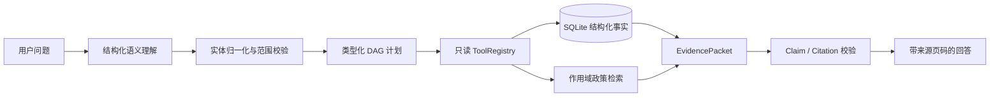

# SWUFE 教务智能问答

[](https://github.com/ZorIgn/swufe-rag/actions/workflows/tests.yml)

面向西南财经大学学生的教务知识问答系统。项目将培养方案课程表、毕业学分要求和校级教务制度放在同一条可验证的查询链路中：适合精确计算的课程事实交给 SQLite，适合解释的制度文本默认交给 BM25 + dense + RRF + CrossEncoder + MMR 混合检索，大语言模型负责理解自然语言和组织表达，程序负责校验数字、课程集合、范围和引用。

系统的目标不是让模型“记住”教务信息，而是让每个学校事实都能回到来源、物理页码和对应证据。

## 能回答什么

- 某年级、某专业、某学期有哪些课程；
- 课程代码、名称、学分、学期、课程性质和所属模块；
- 毕业最低学分、模块最低学分和培养要求；
- 培养目标、英语免修、学籍、考试、转专业、推免等制度问题；
- 根据已修课程估算模块完成度，并说明计算依据；
- 展示引用文件、物理页码和原始来源定位。

例如：

```text
2023级人工智能专业第6学期有哪些选修课？
2024级网络空间安全专业的专业选修模块最低要修多少学分？
2024级人工智能专业的离散数学多少学分，在哪个学期开设？
大学英语达到什么条件可以免修？
我已经修完这些课程，还差多少专业选修学分？
```

课程计划与实时开课、选课余量是不同信息。涉及当学期实际开课或剩余名额时，系统会明确提示应以教务系统为准。

## 为什么是 SQL + RAG

培养方案同时包含结构化课程表和需要阅读上下文的文字条款。只做向量检索，难以可靠完成“专业 + 年级 + 学期 + 课程性质”的多条件筛选；只做数据库，又无法完整表达制度例外、培养目标和表格脚注。

| 信息类型 | 主要处理方式 | 示例 |
|---|---|---|
| 课程、学分、学期、代码、性质 | 参数化 SQL 工具 | “23级第6学期有哪些专业选修课？” |
| 培养目标、制度条款、办事规则 | 作用域检索与 RAG | “英语免修有哪些条件？” |
| 学业规划、模块完成度 | SQL + RAG | “已修完这些课，还差多少学分？” |
| 非教务闲聊 | 通用表达 | 不进入学校事实检索链路 |

## 查询流程


```mermaid
flowchart LR
    Q[用户问题] --> U[结构化语义理解]
    U --> N[实体归一化与范围校验]
    N --> P[类型化 DAG 计划]
    P --> T[只读 ToolRegistry]
    T --> S[(SQLite 结构化事实)]
    T --> R[作用域政策检索]
    S --> E[EvidencePacket]
    R --> E
    E --> V[Claim / Citation 校验]
    V --> A[带来源页码的回答]
```

模型不能直接编写或执行 SQL，也不能自行调用未注册的工具。所有计算由程序生成 `DerivedFact`，回答中的学校事实必须绑定到对应证据；证据缺失、范围不匹配、版本冲突或引用不支持时，系统会拒答或请求补充范围。

## 当前知识库

资料包括本科培养方案和校级、院级教务文件，覆盖课程表、毕业要求、培养目标、学籍、课程考核、英语免修、转专业、学位授予和推免等主题。课程记录、培养要求、来源版本、物理页码和解析 provenance 会在构建时写入 SQLite 与知识块索引。

数据文件和向量索引属于可再生产物，不直接提交到 Git。每次构建都会在 `artifacts/manifests/` 写入不可变清单，记录数据版本、来源哈希、页数、课程/要求数量、嵌入模型和索引信息；运行中的清单是数据规模的唯一依据。

## 快速开始

### 1. 安装环境

推荐使用 Python 3.11 及 `uv`：

```powershell
git clone https://github.com/ZorIgn/swufe-rag.git
cd swufe-rag
uv sync --locked --extra dev --extra retrieval
```

### 2. 准备数据并构建数据库

从项目数据发布目录或显式 URL 准备 `sources.csv`、`chunks.jsonl`、`curriculum_catalog.json`、`source_review.csv` 和 `evidence_review.csv`；两个审核账本用于管理可进入回答链路的可信证据。代码仓库不包含生成数据；没有数据目录时，需要先取得项目数据包：

```powershell
python -m scripts.download_dataset --source-dir <released-data-directory>
# 或：python -m scripts.download_dataset --url <dataset-zip-url>
python -m scripts.build_all
python -m scripts.verify_dataset --allow-review-required-requirements
```

`--allow-review-required-requirements` 只允许带有 `review_required` 标记的培养要求出现在清单中；这些记录仍不会被回答逻辑当作已确认事实。构建结果默认位于 `data/academic.sqlite3`、`artifacts/retrieval/<dataset_version>/` 和 `artifacts/manifests/`，运行时会校验版本、顺序、维度与产物哈希。离线结构化测试可显式设置 `SWUFE_RETRIEVAL_MODE=lexical`，并使用 `tests/canonical/data/` 小型夹具。

### 3. 启动服务

```powershell
python -m app.server
```

打开 <http://127.0.0.1:8000/docs> 查看接口文档；`/health/live` 检查进程，`/health/ready` 检查数据库与数据版本。

如果需要使用外部 OpenAI-compatible 模型，必须同时显式配置 `SWUFE_LLM_BASE_URL` 和 `SWUFE_LLM_MODEL`，再在请求头传入 `X-LLM-API-Key`。只有 API Key 而没有这两个配置时，问题和证据不会被发送到外部服务。

## HTTP API

| 方法 | 路径 | 用途 |
|---|---|---|
| `GET` | `/health/live` | 进程存活检查 |
| `GET` | `/health/ready` | 数据与运行时就绪检查 |
| `GET` | `/options` | 获取数据集和专业范围 |
| `POST` | `/ask` | 自然语言教务问答 |
| `GET` | `/source/{chunk_id}` | 查看来源标题、页码和证据定位 |
| `GET` | `/academic-audit/options` | 获取学业审计范围 |
| `POST` | `/academic-audit` | 按已修课程计算培养方案完成度 |

最小请求：

```powershell
curl.exe -X POST http://127.0.0.1:8000/ask `
  -H "Content-Type: application/json" `
  -d '{"question":"2024级网络空间安全专业的专业选修模块最低要修多少学分？","cohort":2024,"major":"网络空间安全专业"}'
```

不传 `X-LLM-API-Key` 时，服务使用本地确定性理解与表达路径；只有同时配置了外部模型地址、模型名并传入请求头时，才会发起模型请求。请求体不接受 API Key 字段。成功响应为 `200`；请求结构错误为 `400/422`，外部模型未配置或不可用时的带 Key 请求为 `503`。

主要响应字段：

- `answer_md`：经过事实与引用校验的 Markdown 答案；
- `citations`：来源标题、证据原文和物理页码；
- `claims`：回答中的事实句及其 `fact_ids`、`evidence_ids`；
- `refused`：证据不足、冲突或范围不明确时为 `true`；
- `clarification`：需要补充年级、专业或时间范围时的提示。

MCP 客户端可通过 `agent.mcp.MCPAdapter` 使用同一组类型化工具，HTTP 与 MCP 共用参数校验、证据包和回答校验逻辑。

## 测试

```powershell
python -m pytest -q tests/canonical
python -m eval.run_generalization --database data/academic.sqlite3 --retrieval-mode lexical
python -m eval.run_product_smoke --database data/academic.sqlite3 --retrieval-mode lexical
python -m eval.run_retrieval_ablation --documents eval/dev/retrieval_documents.jsonl --queries eval/dev/retrieval_queries.json --variants lexical hybrid --dataset-version 2.0
```

Canonical 测试覆盖实体归一化、工具规划、SQLite 操作、来源版本与冲突、证据覆盖、声明绑定、API/MCP 契约、BYOK 安全和提示注入。检索消融可同时报告 lexical 与 artifact-backed hybrid 指标，结果写入 `eval/reports/`。

## 数据更新

新增或替换资料时，先在来源登记表中记录官方 URL、版本和生效范围，再重新构建：

```powershell
python -m scripts.download_dataset --source-dir <released-data-directory>
python -m scripts.build_all
python -m scripts.verify_dataset --allow-review-required-requirements
```

`verify_dataset` 会检查重复来源、孤立知识块和 provenance、页码、课程代码、学分、学期、专业关系、重复课程以及缺少证据的培养要求。严重错误会阻止构建，避免把无法追溯的数字直接写入数据库。

## 项目结构

```text
academic/       结构化课程、培养要求、来源版本与学术工具
agent/          有界运行时、会话、追踪、策略、ToolRegistry 与 MCP
app/server/     唯一 FastAPI 服务入口
query/          语义理解、实体归一化与类型化计划
evidence/       Fact、DerivedFact、provenance 与 coverage
generation/     受约束生成、渲染和 claim/citation 校验
ingest/         来源解析、页码保留和知识块切分
retrieval/      作用域检索与候选排序
storage/        数据库连接、生命周期和脱敏
scripts/        数据下载、构建和完整性检查
docs/           架构、数据模型、安全与评测说明
eval/           开发集、holdout 和评测脚本
tests/canonical/ 离线单元与 API/MCP 契约测试
```

## 使用边界

- 培养方案描述计划安排，不等于当学期实际开课、选课余量、成绩或正式毕业审核；
- 学分完成度是基于输入课程清单和结构化培养要求的辅助计算，正式结果以学校教务系统和相关部门审核为准；
- 不同年级、专业和政策版本不能混用，缺少必要范围时系统会请求澄清；
- 没有权威、匹配且无冲突的证据时，系统不会让模型猜测学校规定；
- 文档内容被视为数据，不会因为原文中出现指令而改变系统规则或执行额外工具。

## 进一步阅读

- [架构说明](docs/ARCHITECTURE.md)：组件边界与请求链路
- [数据模型](docs/DATA_MODEL.md)：结构化事实、来源和 provenance
- [Agent 运行时](docs/AGENT_RUNTIME.md)：有界状态机、会话和工具调用
- [检索说明](docs/RETRIEVAL.md)：作用域过滤、混合候选与排序
- [评测说明](docs/EVALUATION.md)：开发集、holdout 与指标
- [安全说明](docs/SECURITY.md)：BYOK、脱敏、限流与提示注入边界

涉及毕业资格、学籍处理、推免资格或当学期选课结果时，请以学校教务系统和相关部门最终审核为准。
